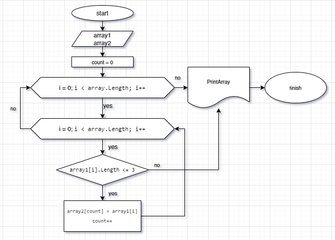

 # Итоговая проверочная работа
## Задание

1. Создать репозиторий на GitHub
2. Нарисовать блок-схему алгоритма (можно обойтись блок-схемой основной содержательной части, если вы выделяете её в отдельный метод)
3. Снабдить репозиторий оформленным текстовым описанием решения (файл README.md)
4. Написать программу, решающую поставленную задачу
5. Использовать контроль версий в работе над этим небольшим проектом (не должно быть так, что всё залито одним коммитом, как минимум этапы 2, 3, и 4 должны быть расположены в разных коммитах)

## Решение

1. Ссылка на созданный репозиторий:
https://github.com/EliaGabdr/FinalWork
2. 
3. В процессе.
4. Решение задачи в файле Program.cs.
5. Список коммитов по команде git log:
* began to fill README.md
* add 3
* add 4
* add 5
* clear
* clear 2
* program launch
* add new console
* final commit
